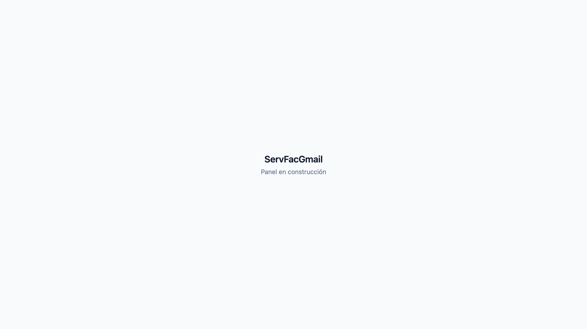
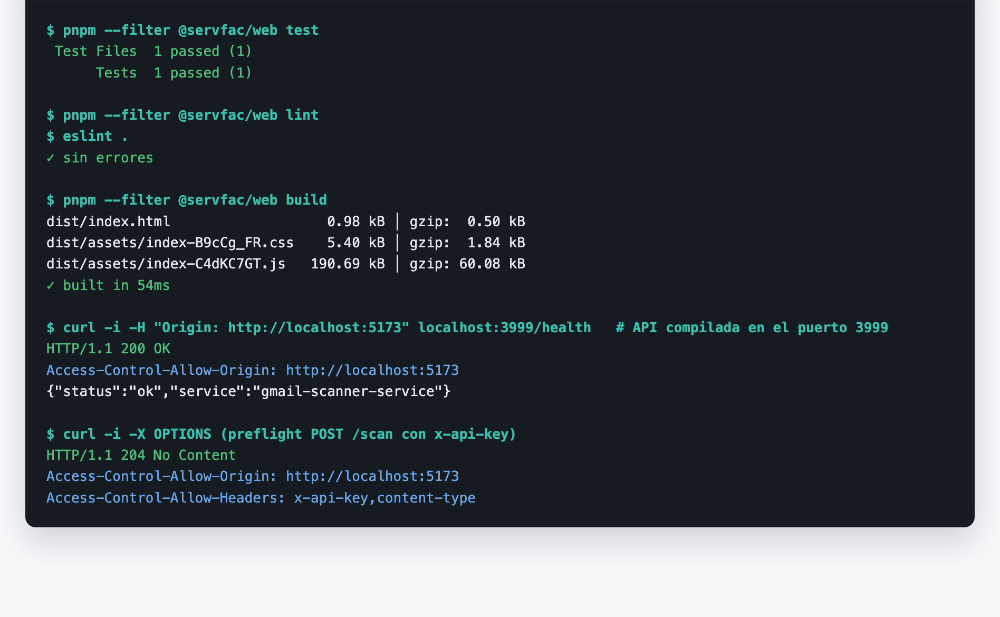
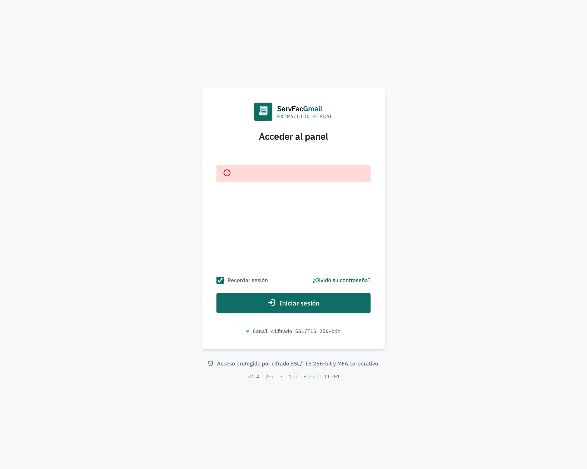
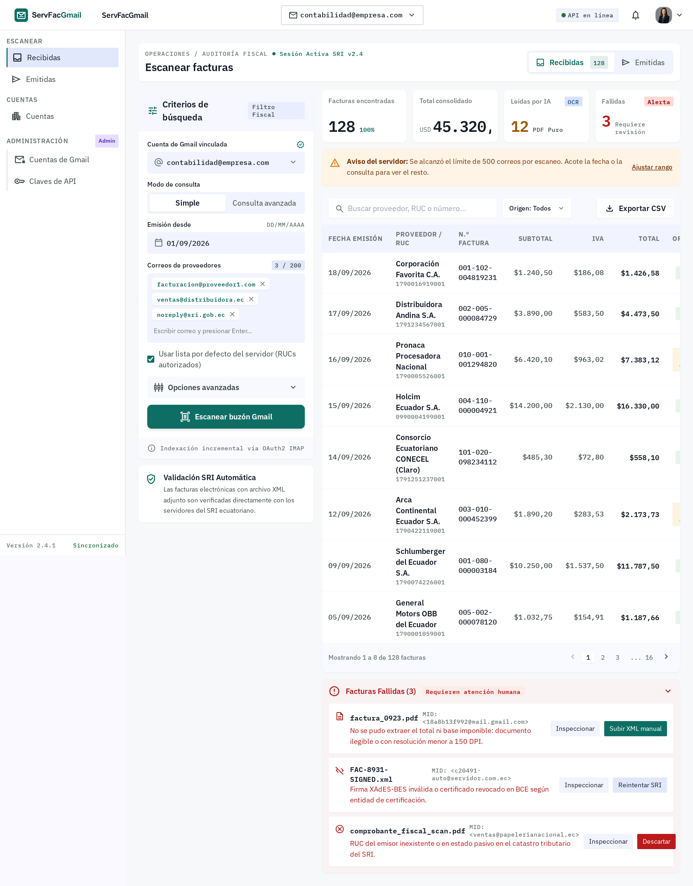
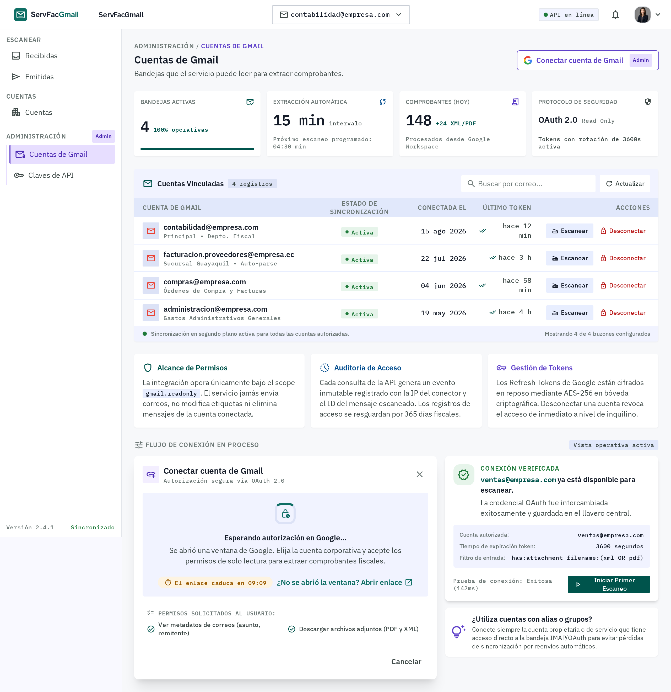
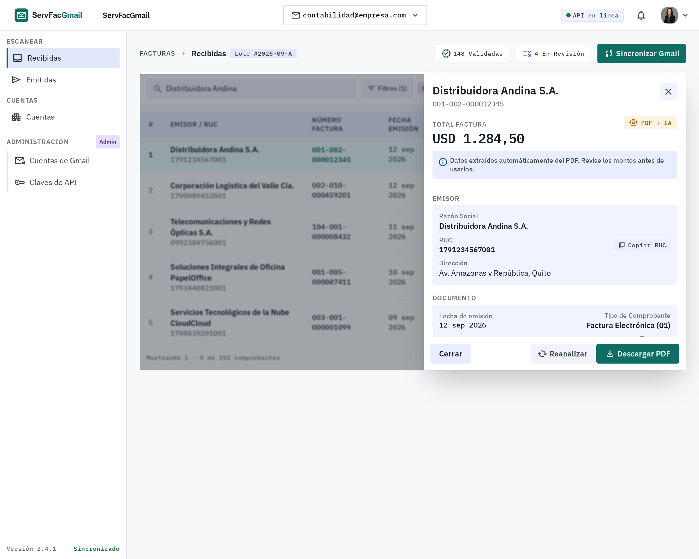
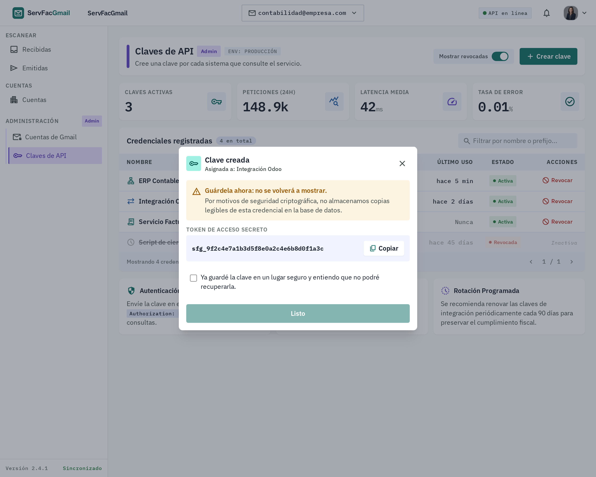

# ServFacGmail Web (`@servfac/web`)

Panel web para el servicio de escaneo de facturas de Gmail (`apps/api`). React 19 + Vite, Tailwind CSS v4, React Router, React Query y axios.

- Sistema de diseño: [`DESIGN.md`](./DESIGN.md)
- Prompts de Google Stitch: [`STITCH.md`](./STITCH.md)
- Plan de trabajo y estado del proyecto: [`PLAN.md`](./PLAN.md)

## Comandos

Desde la raíz del monorepo:

```bash
pnpm dev:web                          # servidor de desarrollo en http://localhost:5173
pnpm --filter @servfac/web test       # pruebas (Vitest + Testing Library)
pnpm --filter @servfac/web lint       # ESLint
pnpm --filter @servfac/web build      # build de producción en apps/web/dist
```

## Configuración

Copiar `.env.example` a `.env` en `apps/web/`:

| Variable | Ejemplo | Uso |
|---|---|---|
| `VITE_API_URL` | `http://localhost:3005` | URL base de la API |
| `VITE_APP_NAME` | `ServFacGmail` | Nombre de la aplicación |

La API rechaza orígenes de navegador por defecto: en `apps/api/.env` debe estar `CORS_ORIGINS=http://localhost:5173` (o el dominio del frontend en producción).

## Estructura

```
src/
├── api/          axios.js + routes/ (un archivo por recurso del backend)
├── assets/       css/ (tokens y estilos base), logos/
├── components/   componentes de presentación (solo props)
├── hooks/        acceso a datos con React Query
├── layouts/      layouts de ruta (app, administración, acceso)
├── lib/          utilidades puras
├── pages/        una página por ruta
├── stores/       estado global con React Context
└── tests/        setup de Vitest y pruebas
```

Detalle y reglas en [`PLAN.md`](./PLAN.md#estructura-de-carpetas).

---

## Avance

### Fase 0 — Preparación del entorno

Proyecto base listo: cliente HTTP corregido (`import.meta.env`), `.env` en la raíz, CORS habilitado para el frontend, Tailwind v4, Vitest y la estructura de carpetas. La app muestra por ahora una página provisional; las pantallas llegan desde la Fase 1.

**App ejecutándose** (`pnpm build` + `vite preview`):



**Verificación**: pruebas, lint y build en verde; la API acepta el origen `http://localhost:5173`, incluida la cabecera `x-api-key` en el preflight de CORS.



### Diseños de referencia (Google Stitch)

Pantallas exportadas a [`design/stitch/`](./design/stitch/) que se integrarán en las próximas fases. Algunos elementos que Stitch añadió no tienen respaldo en la API y no se implementarán: ver [`design/stitch/README.md`](./design/stitch/README.md).

| Acceso — Fase 2 | Escanear facturas recibidas — Fase 4 |
|---|---|
|  |  |

| Cuentas de Gmail — Fase 3 | Detalle de factura — Fase 5 |
|---|---|
|  |  |

| Claves de API — Fase 6 |
|---|
|  |
